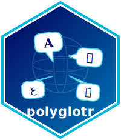

# polyglotr <a href="https://tomeriko96.github.io/polyglotr/"></a>

[](https://github.com/Tomeriko96/polyglotr/actions/workflows/R-CMD-check.yaml)
[](https://CRAN.R-project.org/package=polyglotr)
[](https://cran.r-project.org/package=polyglotr)
[](https://cran.r-project.org/package=polyglotr)
[](https://diffify.com/R/polyglotr)
[](https://edulytics.shinyapps.io/polyglotr/)

R package for text translation via free APIs — no API keys needed for most services.

Supports [Google Translate](https://translate.google.com/m), [Apertium](https://apertium.org/apy/), [MyMemory](https://mymemory.translated.net/), [PONS](https://en.pons.com/translate), [QCRI](https://www.hbku.edu.qa/en/qcri), and [Wikimedia Translation](https://translate.wmcloud.org/).

## Installation

```r
install.packages("polyglotr")

# development version
remotes::install_github("Tomeriko96/polyglotr")
```

## Usage

```r
library(polyglotr)

google_translate("Hello, world!", target_language = "fr")

apertium_translate("Hello, world!", target_language = "es", source_language = "en")
```

Translate multiple texts into multiple languages at once:

```r
texts <- c("Hello, how are you?", "I love programming!", "This is a test.")
languages <- c("es", "fr", "de")

create_translation_table(texts, languages)

#>        Original_word                     es                          fr                       de
#> 1 Hello, how are you?     ¿Hola, cómo estás? Bonjour comment allez-vous?   Hallo, wie geht's dir?
#> 2 I love programming! ¡Me encanta programar!        J'adore programmer ! Ich liebe Programmieren!
#> 3     This is a test.    Esto es una prueba.              C'est un test.        Das ist ein Test.
```

See the [reference page](https://Tomeriko96.github.io/polyglotr/reference/index.html) for all functions and the [vignettes](https://Tomeriko96.github.io/polyglotr/articles/) for detailed examples.

## Shiny App

<a href="https://edulytics.shinyapps.io/polyglotr/" target="_blank"></a>

A web UI for non-R users. Requires `shiny`, `shinydashboard`, and `DT`.

```r
launch_polyglotr_app()
```

## Contributing

PRs welcome. Fork, branch, and open a pull request against `main`.

## License

MIT — see [LICENSE](LICENSE).

## Citation

```
Iwan, T. (2023). polyglotr: Multilingual Text Translation in R.
https://github.com/Tomeriko96/polyglotr
```

## Related

- [googleLanguageR](https://github.com/ropensci/googleLanguageR): R client for the Google Translation API, Cloud Natural Language API, Cloud Speech API, and Cloud Text-to-Speech API
